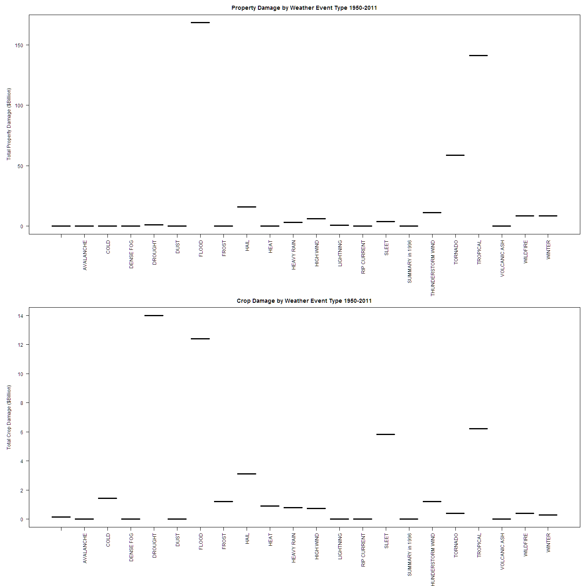
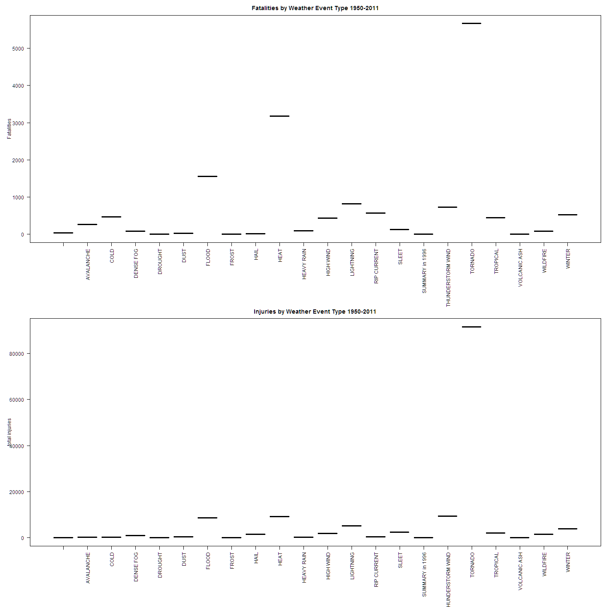

================================================================================
# An Analysis of some Weather Data to Determine Economic and Human Costs

#### by Fred Schmidt fred@rosenschmidt.org, July 2014

For coursera Reproducible Data with Roger Peng et. al.
Part of the Data Science sequence of courses.

================================================================================

## Synopsis

TO DO
 - histogram bars - don't have control over them
 - scaling of graphs
 - conclusions

This is a short analysis of data from NOAA weather 
[storm database](http://www.ncdc.noaa.gov/stormevents/details.jsp).
**.pdf** documentation is at
[NOAA](http://www.ncdc.noaa.gov/stormevents/pd01016005curr.pdf).

The goal is to measure, in a simple way, the economic and human
costs of various weather events.

This analysis and its data are posted on my github site,
[rosenschmidt](https://github.com/rosenschmidt/RepResAssignment2)
along with the actual data used and, by the time you are reading this,
perhaps some additional ancillary material.

================================================================================

## Data Processing

Due to problems in the data, we must clean it up, deciding
which weather events are "the same" in some sense.
As described below, the data provided for the course assignment
appear to have been massaged somewhat and may be different than
what one might download directly from that site.

### Data Sources

For the course, we are given a complete
[file](http://d396qusza40orc.cloudfront.net/repdata%2Fdata%2FStormData.csv.bz2),
where all the years from 1950 through 2011 are in one **.csv** file.

The [NOAA](http://www.ncdc.noaa.gov/stormevents/details.jsp) web site
gave me a hint of the troubles to come. 
In particular, the database allows 48 different types of weather event,
yet the dataset we are given for the class has nearly a thousand!

I considered downloading the data from the original source,
but I did not see any way to easily
replicate what we were given (all years in one file).
Furthermore, a cursory inspection
of the NOAA data revealed that it did not *seem* to have the problems.

So we stick with what we were given.

### The Computing Environment I Used

We use the command provided within **R** to show the environment:

```r
sessionInfo()
```

```
## R version 3.1.1 (2014-07-10)
## Platform: x86_64-w64-mingw32/x64 (64-bit)
## 
## locale:
## [1] LC_COLLATE=English_United States.1252 
## [2] LC_CTYPE=English_United States.1252   
## [3] LC_MONETARY=English_United States.1252
## [4] LC_NUMERIC=C                          
## [5] LC_TIME=English_United States.1252    
## 
## attached base packages:
## [1] stats     graphics  grDevices utils     datasets  methods   base     
## 
## other attached packages:
## [1] knitr_1.6
## 
## loaded via a namespace (and not attached):
## [1] codetools_0.2-8 digest_0.6.4    evaluate_0.5.5  formatR_0.10   
## [5] markdown_0.7    mime_0.1.1      stringr_0.6.2   tools_3.1.1
```
which shows certain relevant information, except Windows 7 and an Intel
motherboard and CPU.
Afaik this confirms that I am running the 64-bit version of R.

This file was tested and run first in Rgui,
 and only the final run and submission were in Rstudio.


### Unzipping and Reading the Data

We use the cache=TRUE Rmd option, since this is the slowest part


```r
if(!file.exists("repdata-data-StormData.csv.bz2"))
     {
        # I had to change https to http in the URL from the web site,
        # to make this work on my system.
        URL <- "http://d396qusza40orc.cloudfront.net/repdata%2Fdata%2FStormData.csv.bz2"
        download.file(URL,"repdata-data-StormData.csv.bz2")
     }
```

Because on my system I don't need to, I save disk space by not unzipping:
I read the **.bz2** file directly.


```r
# not needed
# bunzip2("repdata-data-stormData.csv.bz2")

main_data <- read.table("repdata-data-StormData.csv.bz2",
                         sep=",",
                         header=TRUE,
                         strip.white=TRUE)
```

================================================================================

### A Further Note on Processing the Data - PROBLEMS WITH EVENT TYPES!

Simple visual inspection of the EVTYPE column of the **main_data** frame
shows big problems with this variable, on which the whole analysis hinges.

Note that I've already begun the data cleaning: namely, the option
**strip.white=TRUE**. That's because there are event types
that differ only in leading or trailing white space.

Gettinge rid of the upper and lower case combinatorics eliminates another 10%.

I will create a table of event types, clean those up, and then use merge
to tack my consolidated event types onto the main data frame.


```r
main_data$EVTYPE <- toupper(main_data$EVTYPE)
# when we use toupper, it converts it to char from factor so we put that back
main_data$EVTYPE <- as.factor(main_data$EVTYPE)

event_types  <- with(main_data,table(EVTYPE))

# we need to do this so it will print nicely

event_types <- as.data.frame(event_types)

# Now, printing y to the terminal ( i.e. "> y <CR> " ) gives
# a nice columnar output.
head(event_types,n=20)
```

```
##                    EVTYPE Freq
## 1      HIGH SURF ADVISORY    1
## 2           COASTAL FLOOD    1
## 3             FLASH FLOOD    1
## 4               LIGHTNING    1
## 5               TSTM WIND    4
## 6         TSTM WIND (G45)    1
## 7              WATERSPOUT    1
## 8                    WIND    1
## 9                       ?    1
## 10        ABNORMAL WARMTH    4
## 11         ABNORMALLY DRY    2
## 12         ABNORMALLY WET    1
## 13   ACCUMULATED SNOWFALL    4
## 14    AGRICULTURAL FREEZE    6
## 15          APACHE COUNTY    1
## 16 ASTRONOMICAL HIGH TIDE  103
## 17  ASTRONOMICAL LOW TIDE  174
## 18               AVALANCE    1
## 19              AVALANCHE  386
## 20           BEACH EROSIN    1
```

These first rows show that even after eliminating
white space and upper/lower case,
there are still 898 weather event types to deal with!
Many are spelling or wording variants,
and a little work with grepl to replace like terms with 
exactly the same term will quickly yield a better analysis.

### An Executive Decision: COMBINE EVENT TYPES

It would be nice to use grepl and so forth to combine all disallowed
types into allowed types, *without* combining allowed types,
 but that gets messy.


Plus, 48 is still a lot of types. For example, what is the difference
between Blizzard, Heavy Snow, Winter Storm, and Winter Weather?
One could argue that misclassification among **allowed types**
disguises the economic and health costs of certain events.

Therefore, even if it means combining **allowed** values, I will do so.
I will come up with my own "tighter" classification, which the **R** 
code below documents.

As we recall from the prior classes, we can add a column
to a data frame merly by naming it.

NOTE that the way that I do this, order *might* matter, because
I am only filling in the EDITED field if I didn't already do so.
Thus words like WIND, RAIN, etc which might appear multiply in descriptions,
are sort of picked out in the order that I manually determined as I did these
sequentially. Your mileage may vary. (However, as we find below, the results
are so clear that for this level of analysis, it doesn't matter that much
how we group them, as long as our grouping is sensible.)


```r
# create an empty additional variable
event_types$EDITED <- rep("",length(event_types$EVTYPE))

# Volcano action is pretty unique
list1 <- c("VOLCAN")
event_types$EDITED[grepl(paste(list1,collapse="|"),event_types$EVTYPE) &
                   (event_types$EDITED == "")] <- "VOLCANIC ASH"

# Tornado is also pretty specific
list2 <- c("TORNADO","WATERSPOUT","FUNNEL","TORNDAO")
event_types$EDITED[grepl(paste(list2,collapse="|"),event_types$EVTYPE) &
                   (event_types$EDITED == "")] <- "TORNADO"

# anything with dust seems to be its own deal
list3 <- c("DUST")
event_types$EDITED[grepl(paste(list3,collapse="|"),event_types$EVTYPE) &
                   (event_types$EDITED == "")] <- "DUST"

# do events with "FLOOD" in them BEFORE other rain/snow/ice events
list4 <- c("FLOOD")
event_types$EDITED[grepl(paste(list4,collapse="|"),event_types$EVTYPE) &
                   (event_types$EDITED == "")] <- "FLOOD"

# keep FROST separate (crop damage)
list5 <- c("FROST")
event_types$EDITED[grepl(paste(list5,collapse="|"),event_types$EVTYPE) &
                   (event_types$EDITED == "")] <- "FROST"

# hail is its own deal (crop damage)
list6 <- c("HAIL")
event_types$EDITED[grepl(paste(list6,collapse="|"),event_types$EVTYPE) &
                   (event_types$EDITED == "")] <- "HAIL"

# put all ICE events together
list7 <- c( "FREEZING", "SLEET", "ICE", "ICY","FREEZE","GLAZE")
event_types$EDITED[grepl(paste(list7,collapse="|"),event_types$EVTYPE) &
                   (event_types$EDITED == "")] <- "SLEET"

# combine the REST of WINTER (non-ICE) events
list8 <- c("WINTER", "WINTRY", "BLIZZARD", "THUNDERSNOW")

event_types$EDITED[grepl(paste(list8,collapse="|"),event_types$EVTYPE) &
                   (event_types$EDITED == "")] <- "WINTER"

# COLD
list9 <- c("COLD","CHILL")
event_types$EDITED[grepl(paste(list9,collapse="|"),event_types$EVTYPE) &
                   (event_types$EDITED == "")] <- "COLD"

# HEAT
list10 <- c("HEAT","HOT")
event_types$EDITED[grepl(paste(list10,collapse="|"),event_types$EVTYPE) &
                   (event_types$EDITED == "")] <- "HEAT"


# Thunderstorms
list11 <- c( "TSTM WIND", "THUNDERSTORM", "THUNDER", "TUNDER",
             "THUNDEER", "THUDER", "STORM WIND")

event_types$EDITED[grepl(paste(list11,collapse="|"),event_types$EVTYPE) &
                   (event_types$EDITED == "")] <- "THUNDERSTORM WIND"

# lightning
list12 <- c("LIGHTNING")
event_types$EDITED[grepl(paste(list12,collapse="|"),event_types$EVTYPE) &
                   (event_types$EDITED == "")] <- "LIGHTNING"

# at this point, everything left with snow is also winter
list13 <- c("SNOW")
event_types$EDITED[grepl(paste(list13,collapse="|"),event_types$EVTYPE) &
                   (event_types$EDITED == "")] <- "WINTER"

# TROPICAL STORMS, etc
list14 <- c("TROPICAL", "MARINE", "TSUNAMI", "TYPHOON",
            "HURRICANE", "SURGE", "SURF")

event_types$EDITED[grepl(paste(list14,collapse="|"),event_types$EVTYPE) &
                   (event_types$EDITED == "")] <- "TROPICAL"

# OTHER RAIN - anything left that has the word RAIN
list15 <- c("RAIN")
event_types$EDITED[grepl(paste(list15,collapse="|"),event_types$EVTYPE) &
                   (event_types$EDITED == "")] <- "HEAVY RAIN"

# let's START picking off wind, of which there's a lot
list16 <- c( "HIGH WIND", "MICROBURST", "MICOBURST")

event_types$EDITED[grepl(paste(list16,collapse="|"),event_types$EVTYPE) &
                   (event_types$EDITED == "")] <- "HIGH WIND"

# FIRE
list17 <- c("FIRE", "SMOKE")
event_types$EDITED[grepl(paste(list17,collapse="|"),event_types$EVTYPE) &
                   (event_types$EDITED == "")] <- "WILDFIRE"


# at this point, everything left with WIND is high wind imho
list18 <- c("WIND")
event_types$EDITED[grepl(paste(list18,collapse="|"),event_types$EVTYPE) &
                   (event_types$EDITED == "")] <- "HIGH WIND"

# There are a LOT of events from 1996 called "summary"
# although we have no idea what they mean, let's lump them together
list19 <- c("SUMMARY")
event_types$EDITED[grepl(paste(list19,collapse="|"),event_types$EVTYPE) &
                   (event_types$EDITED == "")] <- "SUMMARY in 1996"

# all the warm left,at this point, means heat
list20 <- c("WARM")
event_types$EDITED[grepl(paste(list20,collapse="|"),event_types$EVTYPE) &
                   (event_types$EDITED == "")] <- "HEAT"

# drought
list21 <- c("DROUGHT", "DRY")
event_types$EDITED[grepl(paste(list21,collapse="|"),event_types$EVTYPE) &
                   (event_types$EDITED == "")] <- "DROUGHT"

# rip tides will have fatalities, and there are about 400 of each spelling
list22 <- c("RIP")
event_types$EDITED[grepl(paste(list22,collapse="|"),event_types$EVTYPE) &
                   (event_types$EDITED == "")] <- "RIP CURRENT"


# remaining urbans are flood
list23 <- c("URBAN")
event_types$EDITED[grepl(paste(list23,collapse="|"),event_types$EVTYPE) &
                   (event_types$EDITED == "")] <- "FLOOD"

# earth movements
list24 <- c("LANDSLIDE", "AVA", "ROCK", "MUD")

event_types$EDITED[grepl(paste(list24,collapse="|"),event_types$EVTYPE) &
                   (event_types$EDITED == "")] <- "AVALANCHE"

# FOG
list25 <- c("FOG")
event_types$EDITED[grepl(paste(list25,collapse="|"),event_types$EVTYPE) &
                   (event_types$EDITED == "")] <- "DENSE FOG"

# GUSTS that aren't something else
list26 <- c("GUST")
event_types$EDITED[grepl(paste(list26,collapse="|"),event_types$EVTYPE) &
                   (event_types$EDITED == "")] <- "HIGH WIND"


# edited_event_types  <- with(event_types,table(EDITED))
# edited_event_types <- as.data.frame(edited_event_types)
```

Now we display a smaller, stylized group of event types to work with.
The frequency of my combined/corrected events is as follows.


```r
rowsum(event_types$Freq,event_types$EDITED)
```

```
##                     [,1]
##                      719
## AVALANCHE           1033
## COLD                2706
## DENSE FOG           1834
## DROUGHT             2579
## DUST                 588
## FLOOD              86141
## FROST               1413
## HAIL              290398
## HEAT                2993
## HEAVY RAIN         11862
## HIGH WIND          26321
## LIGHTNING          15764
## RIP CURRENT          774
## SLEET               2862
## SUMMARY in 1996       75
## THUNDERSTORM WIND 335691
## TORNADO            71538
## TROPICAL            2738
## VOLCANIC ASH          29
## WILDFIRE            4260
## WINTER             39979
```
This shows we still have our expected total of
 902297 events.
So we didn't screw it up!
It leaves only 719 unexplained,
which we'll argue is negligible.

================================================================================

## RESULTS

### COMPUTING RESULTS

We now map our stylized, simplified set of events to the main data set.


```r
main_data <- merge(main_data,event_types,by="EVTYPE")
event_types2  <- with(main_data,table(EDITED))
event_types2 <- as.data.frame(event_types2)
```

Now we do the actual work of the assignment: assigning fatalities, injuries,
and economic damage to these stylized types.

We first make some heroic assumptions about PROPDMGEXP being an exponent on
the dollars in PROPDMG; ditto for crop damage. The vast majority of these
...EXP fields are empty. As before, we are cautious and create a new edited
field and work on that, so we can compare results. Inspection of the exponents
shows we have nothing, +,-,?,and positive integers 0-9. 


```r
as.data.frame(with(main_data,table(PROPDMGEXP)))
```

```
##    PROPDMGEXP   Freq
## 1             465934
## 2           -      1
## 3           ?      8
## 4           +      5
## 5           0    216
## 6           1     25
## 7           2     13
## 8           3      4
## 9           4      4
## 10          5     28
## 11          6      4
## 12          7      5
## 13          8      1
## 14          B     40
## 15          h      1
## 16          H      6
## 17          K 424665
## 18          m      7
## 19          M  11330
```

```r
as.data.frame(with(main_data,table(CROPDMGEXP)))
```

```
##   CROPDMGEXP   Freq
## 1            618413
## 2          ?      7
## 3          0     19
## 4          2      1
## 5          B      9
## 6          k     21
## 7          K 281832
## 8          m      1
## 9          M   1994
```

Nevertheless, we plunge ahead.


```r
main_data$PD_EXPONENT <- as.character(main_data$PROPDMGEXP)
main_data$PD_EXPONENT[main_data$PD_EXPONENT==""] <- 0
main_data$PD_EXPONENT[grepl("\\+|\\-|\\?",main_data$PD_EXPONENT)] <- 0 # ignore
main_data$PD_EXPONENT[grepl("h|H",main_data$PD_EXPONENT)] <- 2 # hundreds
main_data$PD_EXPONENT[grepl("k|K",main_data$PD_EXPONENT)] <- 3 # thousands
main_data$PD_EXPONENT[grepl("m|M",main_data$PD_EXPONENT)] <- 6 # millions
main_data$PD_EXPONENT[grepl("b|B",main_data$PD_EXPONENT)] <- 9 # billions
main_data$PD_EXPONENT <- as.numeric(main_data$PD_EXPONENT)

main_data$CD_EXPONENT <- as.character(main_data$CROPDMGEXP)
main_data$CD_EXPONENT[main_data$CD_EXPONENT==""] <- 0
main_data$CD_EXPONENT[grepl("\\+|\\-|\\?",main_data$CD_EXPONENT)] <- 0 # ignore
main_data$CD_EXPONENT[grepl("h|H",main_data$CD_EXPONENT)] <- 2 # hundreds
main_data$CD_EXPONENT[grepl("k|K",main_data$CD_EXPONENT)] <- 3 # thousands
main_data$CD_EXPONENT[grepl("m|M",main_data$CD_EXPONENT)] <- 6 # millions
main_data$CD_EXPONENT[grepl("b|B",main_data$CD_EXPONENT)] <- 9 # billions
main_data$CD_EXPONENT <- as.numeric(main_data$CD_EXPONENT)

main_data$PROP_DAMAGE <- main_data$PROPDMG * 10^main_data$PD_EXPONENT
main_data$CROP_DAMAGE <- main_data$CROPDMG * 10^main_data$CD_EXPONENT
```

================================================================================

### RESULTS NUMERICALLY


First we compute the totals for events. 

```r
prop_damage <- aggregate(main_data$PROP_DAMAGE,by=list(main_data$EDITED),sum)
colnames(prop_damage) <- c("EVENT","TOTAL")
crop_damage <- aggregate(main_data$CROP_DAMAGE,by=list(main_data$EDITED),sum)
colnames(crop_damage) <- c("EVENT","TOTAL")
fatalities  <- aggregate(main_data$FATALITIES,by=list(main_data$EDITED),sum)
colnames(fatalities) <- c("EVENT","TOTAL")
injuries  <- aggregate(main_data$INJURIES,by=list(main_data$EDITED),sum)
colnames(injuries) <- c("EVENT","TOTAL")

prop_damage$EVENT <- as.factor(prop_damage$EVENT)
crop_damage$EVENT <- as.factor(crop_damage$EVENT)
fatalities$EVENT <- as.factor(fatalities$EVENT)
injuries$EVENT <- as.factor(injuries$EVENT)
```

Now we display them.

### RESULTS PICTORIALLY


```r
par(mfrow=c(2,1),mar=c(10,5,2.5,1),las=2)
plot(prop_damage$EVENT,prop_damage$TOTAL/10^9,
     las=2,
     type="h",
     ylab="Total Property Damage ($Billion)",
     main="Property Damage by Weather Event Type 1950-2011")
plot(crop_damage$EVENT,crop_damage$TOTAL/10^9,
     las=2,
     type="h",
     ylab="Total Crop Damage ($Billion)",
     main="Crop Damage by Weather Event Type 1950-2011")
```

 


```r
par(mfrow=c(2,1),mar=c(10,5,2.5,1),las=2)
plot(fatalities$EVENT,fatalities$TOTAL,
     las=2,
     type="h",
     ylab="Fatalities",
     main="Fatalities by Weather Event Type 1950-2011")
plot(injuries$EVENT,injuries$TOTAL,
     las=2,
     type="h",
     ylab="total injuries",
     main="Injuries by Weather Event Type 1950-2011")
```

 
I can't figure out how to make histograms with bars when the x axis variable
is a factor. But this assigment is an analysis, and I won't attempt to be
publication quality.

================================================================================

## SUMMARY

Far and away, property damage is caused by events that are flood, tropical
storm, or tornado related. Crop damage is caused by drought, flood, sleet,
and tropical storm events, with hail a distant fifth.

Fatalities are far and away caused by tornadoes, with heat and floods coming in
not so much.  Lightning and thunderstorms lead the back of the pack.
Injuries are also far and away caused by tornadoes, with heat, thunderstorms,
and flood tied for a very distand 2nd place.

================================================================================
================================================================================
